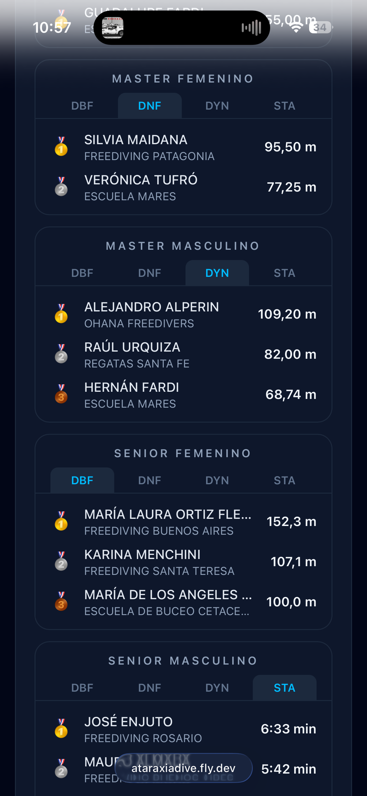
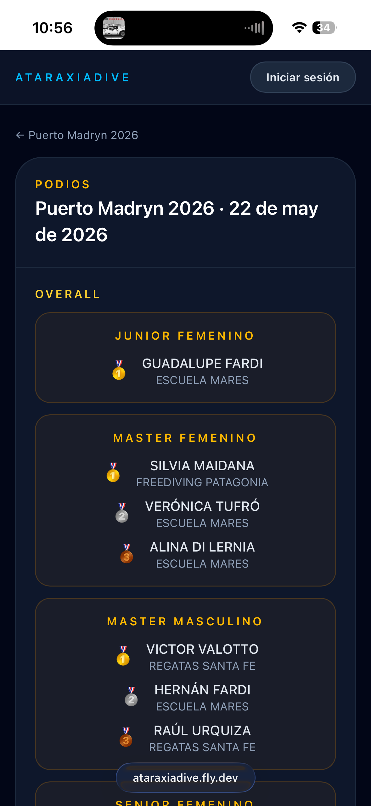

# Ver resultados y podios

## Resultados en tiempo real

Cuando un torneo está **En ejecución**, podés seguir los resultados a medida que se van registrando. Desde el detalle del torneo, tocá **"Resultados"** para acceder.

La pantalla de resultados muestra:

- Pestañas por disciplina (DBF, DNF, DYN, STA…) para cambiar de ranking
- El ranking ordenado de cada disciplina, con el club de cada atleta
- Columnas: **Anuncio** (marca declarada / AP), **OT** (hora de inicio), **Performance** (marca realizada / RP) y **Tarjeta**
- Estado de cada tarjeta (blanca, blanca con penalizaciones, roja, DNS) y el motivo cuando corresponde

> Los resultados son provisorios durante la ejecución. Los valores finales se consolidan al cerrar el torneo.

## Resultados finales

Una vez que el torneo pasa a estado **Premiación** o **Cerrado**, los resultados son definitivos. Podés acceder al ranking completo desde el detalle del torneo → **"Resultados"**.

## Podios

Los podios se habilitan desde el estado **Premiación** en adelante. Desde el detalle del torneo tocá el botón **"Podios"**.

### Podio por disciplina

Para cada categoría (por género y edad) podés cambiar de disciplina con las pestañas (DBF, DNF, DYN, STA…) y ver el top 3 con su medalla, club y marca.

### Podio Overall

La vista **Overall** muestra el top 3 de cada categoría combinando todas las disciplinas — el resultado general del torneo.

