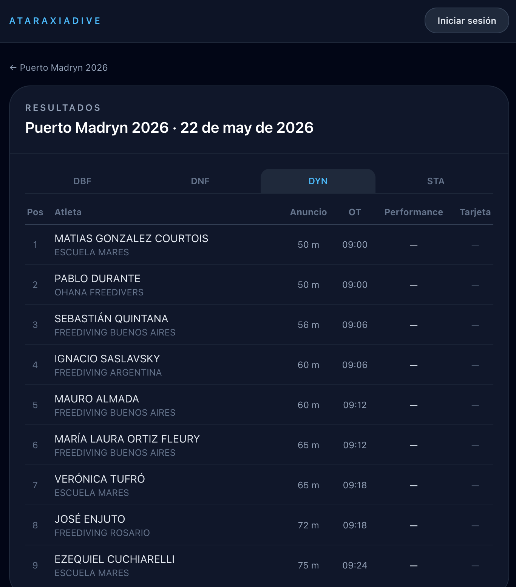
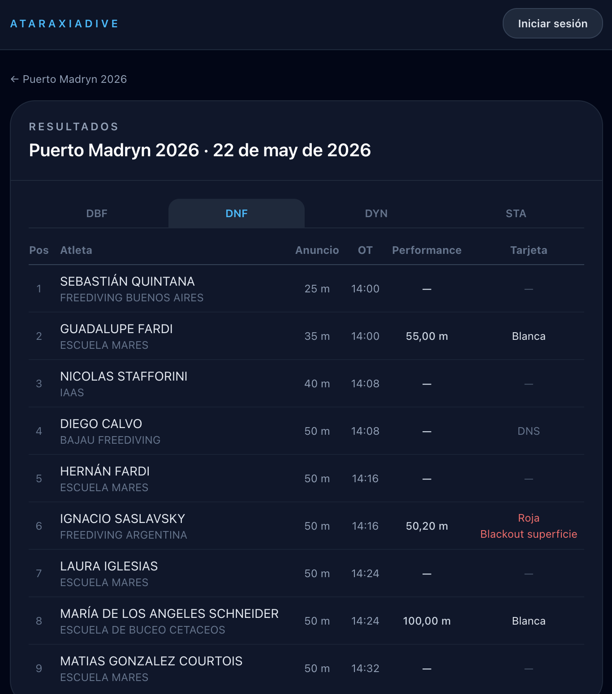
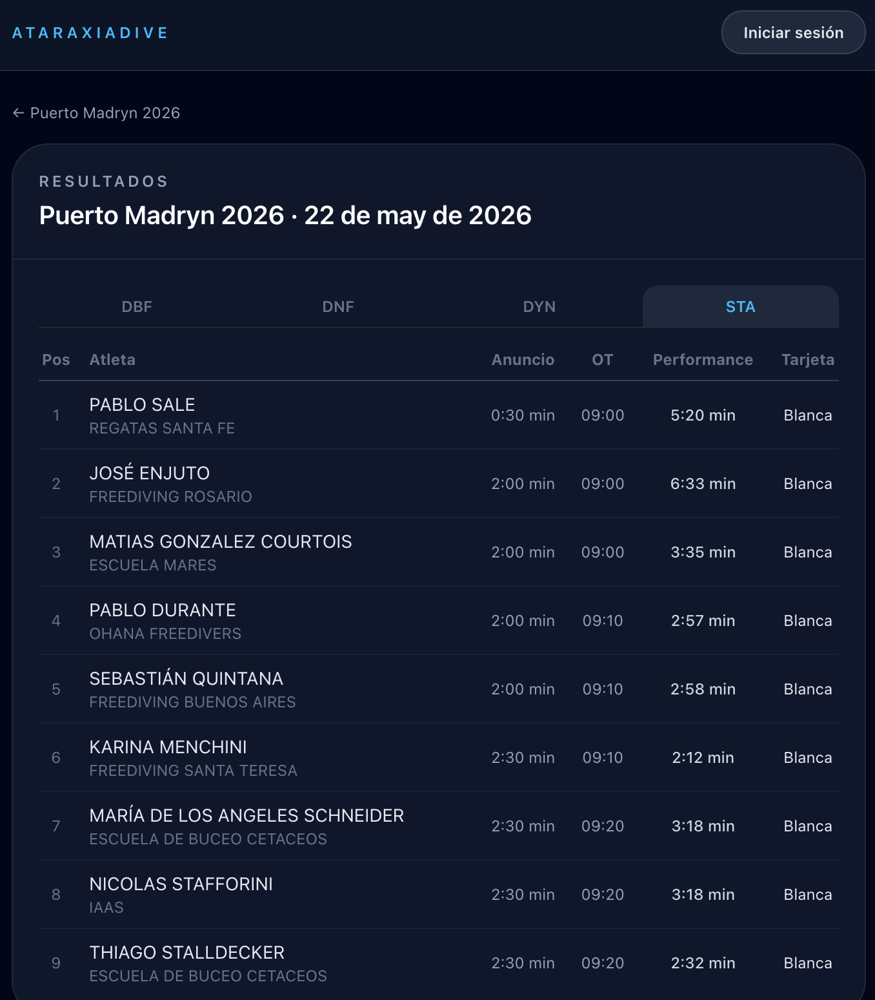

# Ver resultados y podios

## Resultados en tiempo real

Cuando un torneo está **En ejecución**, podés seguir los resultados a medida que se van registrando. Desde el detalle del torneo, tocá **"Ver panel"** para acceder.

La pantalla de resultados muestra:

- Filtro por disciplina y categoría (género y edad)
- Ranking actualizado con las performances registradas hasta el momento
- Marca obtenida (RP) y estado de cada tarjeta (blanca, blanca con penalizaciones, roja)
- Penalizaciones deducidas cuando corresponde

> Los resultados son provisorios durante la ejecución. Los valores finales se consolidan al cerrar el torneo.

## Resultados finales

Una vez que el torneo pasa a estado **Premiación** o **Cerrado**, los resultados son definitivos. Podés acceder al ranking completo desde el detalle del torneo → **"Ver resultados"**.

## Podios

Los podios están disponibles desde el estado **Premiación** en adelante. Muestran el top 3 de cada categoría con sus marcas.

Desde el detalle del torneo tocá **"Ver podios"** (si el torneo lo habilita).

