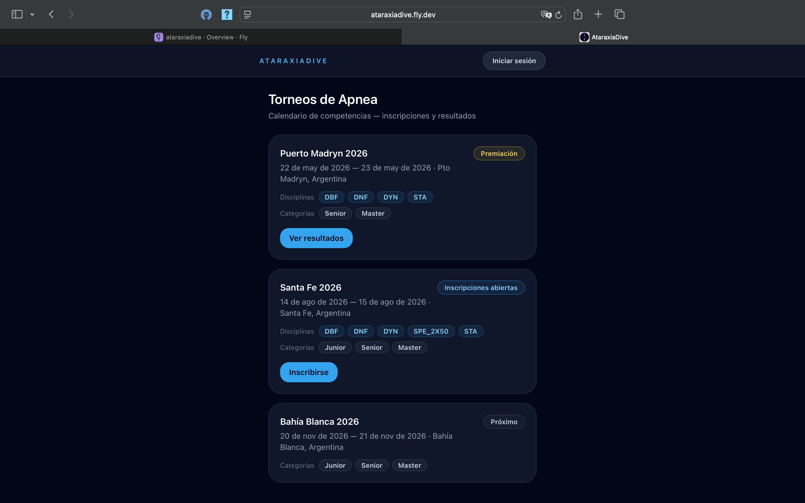
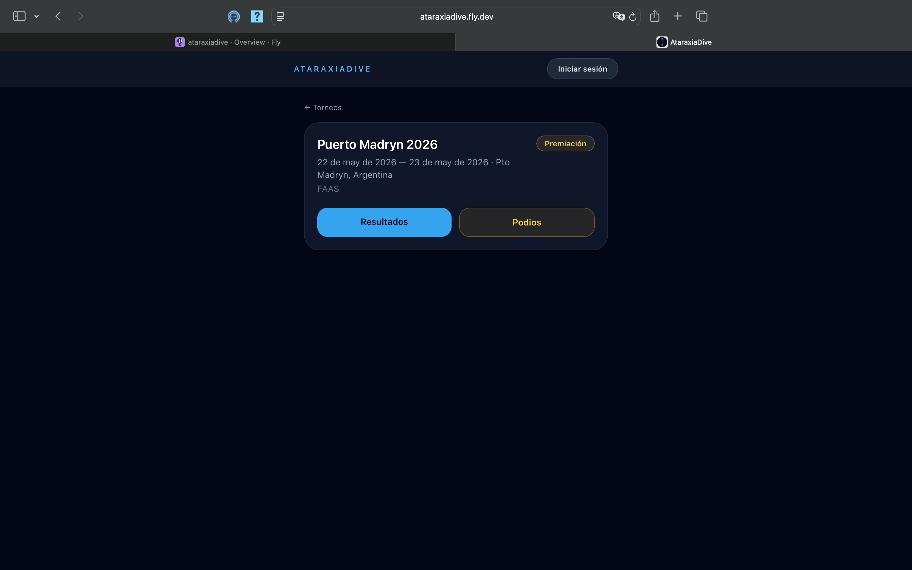
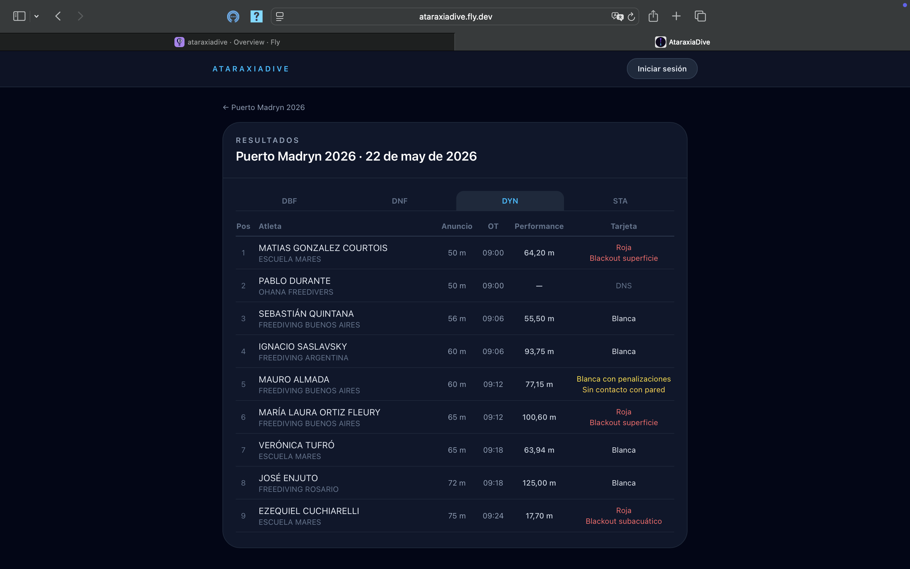
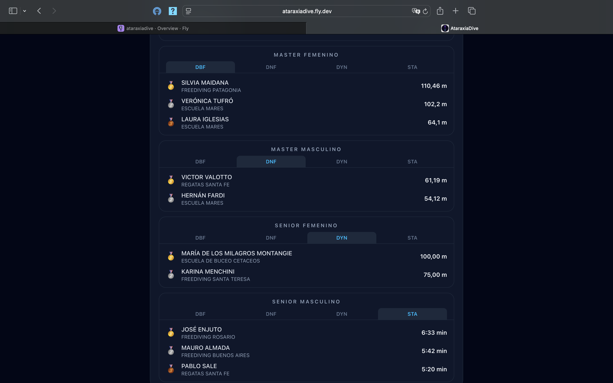
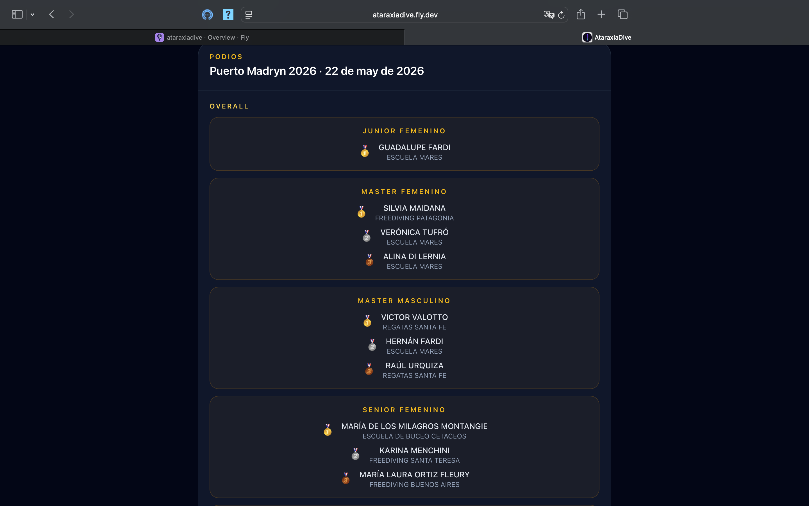

# Vista de escritorio

El portal público es **responsive**: se adapta automáticamente al tamaño de la pantalla. Las guías anteriores usan capturas tomadas desde el celular, pero desde una computadora vas a ver la misma información con un diseño de ancho completo.

A continuación, las mismas pantallas vistas desde el navegador de escritorio.

## Lista de torneos

Las tarjetas se muestran centradas, con las disciplinas, categorías y el estado de cada torneo a la vista.

## Detalle de un torneo

El detalle muestra el nombre, la organización, las fechas, la sede y los botones de acción (**Resultados** y **Podios**).

## Resultados

El ranking de cada disciplina aprovecha el ancho de la pantalla para mostrar todas las columnas (**Anuncio**, **OT**, **Performance** y **Tarjeta**) con más detalle.

## Podios

### Podio por disciplina

### Podio Overall

