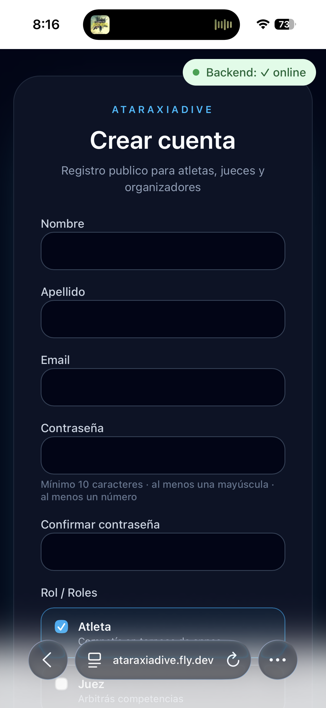
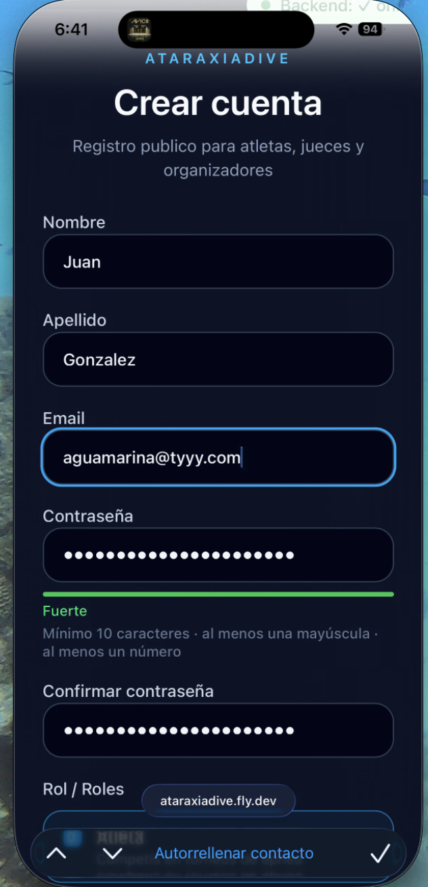
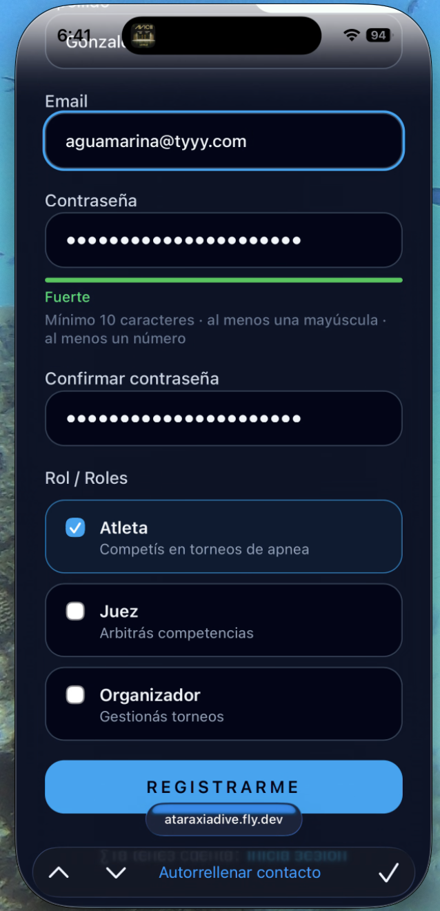
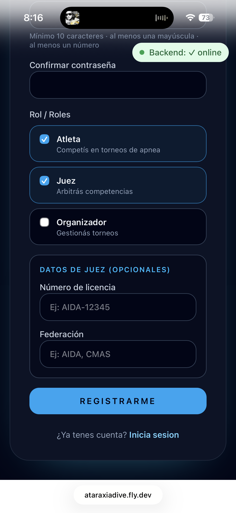
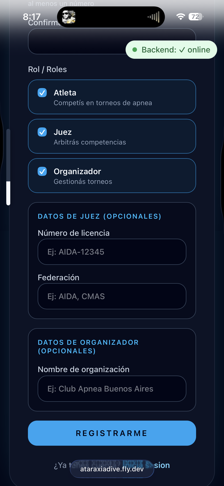

# Crear tu cuenta

Para inscribirte a torneos, declarar performances o gestionar competencias necesitás una cuenta en AtaraxiaDive. El registro es gratuito y toma menos de dos minutos.

## Cómo registrarse

1. Ingresá a [ataraxiadive.fly.dev](https://ataraxiadive.fly.dev)
2. Tocá **"Iniciar sesión"** en la esquina superior derecha
3. En la pantalla de login, tocá **"Crear cuenta"**
4. Completá el formulario

## Datos requeridos

| Campo | Descripción |
|-------|-------------|
| Nombre y apellido | Tu nombre real |
| Email | Será tu usuario para iniciar sesión |
| Contraseña | Mínimo 8 caracteres, debe incluir mayúsculas y números |
| Confirmar contraseña | Debe coincidir con la anterior |
| Rol(es) | Atleta, Juez u Organizador — podés seleccionar más de uno |

### Datos adicionales por rol

- **Atleta:** número de licencia y federación (opcionales, los podés completar después desde Mis Datos)
- **Organizador:** nombre de la organización

## Selección de roles

Podés tener más de un rol. Por ejemplo, un atleta que también organiza torneos puede seleccionar ambos roles al registrarse.

Cuando iniciás sesión con múltiples roles, la plataforma te va a pedir que elijas con cuál rol querés operar en esa sesión.

## Después del registro

Al completar el registro, la plataforma te inicia sesión automáticamente y te lleva a tu portal.

Ver también: [Roles y perfiles](roles.md)
