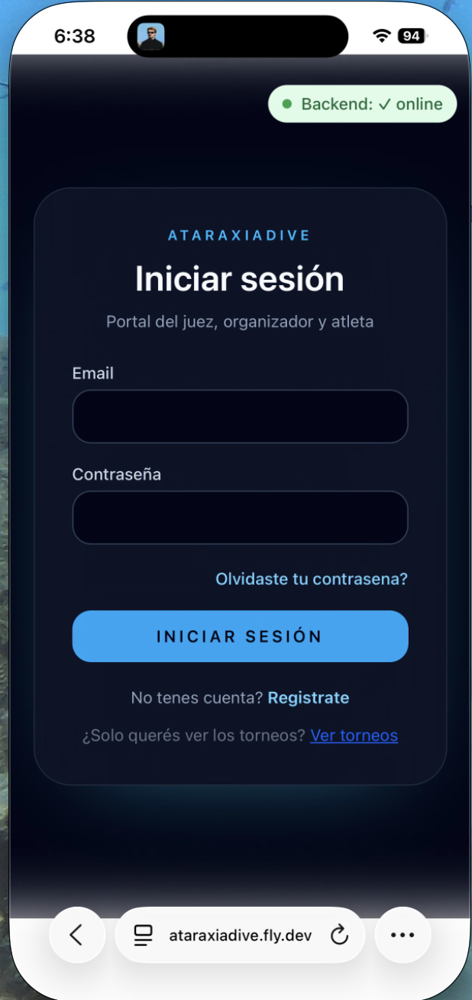

# Iniciar sesión

## Cómo acceder

1. Tocá **"Iniciar sesión"** en la esquina superior derecha de cualquier pantalla del portal público
2. Ingresá tu email y contraseña
3. Tocá **"Ingresar"**

## Selección de rol (usuarios con múltiples roles)

Si tu cuenta tiene más de un rol (por ejemplo, Atleta y Organizador), la plataforma te va a pedir que elijas con cuál rol querés operar en esta sesión.

Esta elección determina a qué portal entrás:

| Rol seleccionado | Portal |
|-----------------|--------|
| Atleta | Portal Atleta |
| Organizador | Portal Organizador |
| Juez | Portal Juez |

Podés cerrar sesión y volver a ingresar con otro rol cuando lo necesites. También podés activar o desactivar roles desde **Mis Datos** en cualquier portal — ver [Roles y perfiles](roles.md).

## Problemas comunes

**"Email o contraseña incorrectos"** — Verificá que el email esté escrito correctamente y que no haya espacios al inicio o al final. Si olvidaste tu contraseña, usá [Recuperar contraseña](recuperar-password.md).

**Olvidé con qué email me registré** — Probá con los emails que usás habitualmente para servicios deportivos.
