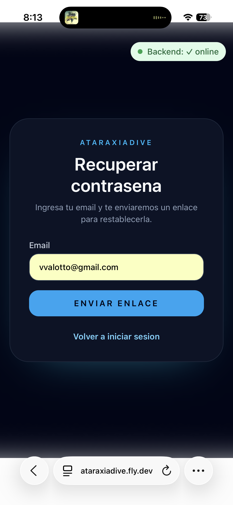

# Recuperar contraseña

Si olvidaste tu contraseña podés restablecerla desde la pantalla de login.

## Pasos

1. En la pantalla de login, tocá **"¿Olvidaste tu contraseña?"**
2. Ingresá el email con el que te registraste
3. Tocá **"Enviar enlace"**
4. Revisá tu bandeja de entrada — vas a recibir un email con un enlace de recuperación
5. Tocá el enlace del email y elegí tu nueva contraseña

## Requisitos de la nueva contraseña

La nueva contraseña debe tener al menos 8 caracteres e incluir mayúsculas y números. La barra de fortaleza en el formulario te indica si la contraseña es suficientemente segura.

## Si no recibís el email

- Revisá la carpeta de spam o correo no deseado
- Verificá que el email ingresado sea exactamente el que usaste al registrarte
- El enlace tiene una validez limitada — si expiró, podés solicitar uno nuevo repitiendo el proceso
