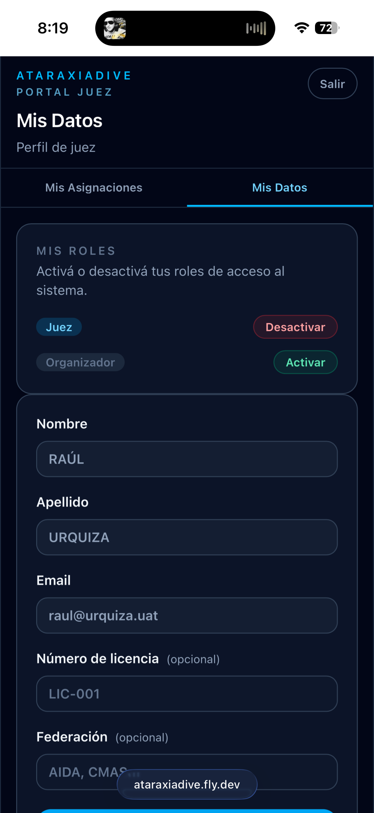

# Roles y perfiles

AtaraxiaDive usa un sistema de roles para determinar a qué portal accedés y qué acciones podés realizar. Una misma cuenta puede tener más de un rol activo.

## Roles disponibles

| Rol | Portal | Para quién |
|-----|--------|------------|
| **Atleta** | Portal Atleta | Competidores que se inscriben y participan en torneos |
| **Organizador** | Portal Organizador | Responsables de crear y gestionar torneos |
| **Juez** | Portal Juez | Jueces asignados a disciplinas para registrar performances |

## Cómo se selecciona el rol al iniciar sesión

Al iniciar sesión, si tu cuenta tiene más de un rol activo, la plataforma te pregunta con cuál rol querés operar. Eso determina a qué portal entrás.

Podés cerrar sesión en cualquier momento y volver a entrar con otro rol.

## Cómo activar o desactivar roles

Desde la sección **Mis Datos** de cualquier portal podés gestionar tus roles:

- Botón **Activar** → el rol está inactivo, tocalo para habilitarlo
- Botón **Desactivar** → el rol está activo, tocalo para quitarlo

!!! warning "No podés desactivar tu único rol activo"
    Si solo tenés un rol activo, el sistema no te permite desactivarlo. Activá otro rol antes de poder quitar el actual.

## Cómo agregar un rol después del registro

Si te registraste con un solo rol y después querés agregar otro:

1. Entrá a cualquier portal con tu rol actual
2. Navegá a **Mis Datos**
3. En la sección **Mis Roles**, tocá **Activar** en el rol que querés agregar
4. Cerrá sesión y volvé a entrar — ahora la plataforma te va a pedir que elijas el rol con el que querés operar

## Perfiles por rol

Cada rol tiene su propio perfil con datos específicos. Podés completarlos desde **Mis Datos** en el portal correspondiente:

| Rol | Datos del perfil |
|-----|-----------------|
| **Atleta** | Fecha de nacimiento, DNI, teléfono, categoría, club, brevet |
| **Juez** | Número de licencia, federación |
| **Organizador** | Nombre de la organización |
