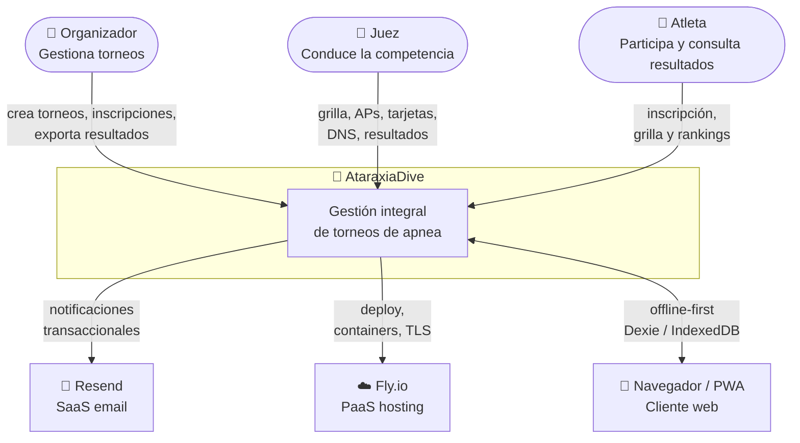

# AtaraxiaDive — Contexto del Sistema (C4 L1)

## ¿Qué es AtaraxiaDive?

Aplicación web para la **gestión integral de torneos de apnea (freediving)**. Cubre el ciclo completo: creación del torneo, inscripción de atletas, ejecución en pileta con jueces, cálculo de rankings y publicación de resultados.

Opera en modo **offline-first**: el cliente PWA puede funcionar sin conectividad durante la competencia y sincronizar al recuperar red.

---

## Diagrama de contexto

---

## Actores

| Actor | Rol | Acciones principales |
|-------|-----|----------------------|
| **Organizador** | Administra el torneo | Crear torneo, habilitar inscripciones, avanzar etapas del ciclo, exportar resultados |
| **Juez** | Conduce la competencia | Generar y confirmar grilla, registrar APs, resultados y tarjetas, marcar DNS |
| **Atleta** | Participa en el torneo | Inscribirse, consultar grilla y resultados propios |

> Los roles Organizador y Juez pueden coexistir en la misma persona en torneos pequeños. El modelo de identidad los gestiona como roles intercambiables — ver [[arquitectura/identidad]].

---

## Sistemas externos

| Sistema | Tipo | Relación |
|---------|------|----------|
| **Resend** | SaaS de email transaccional | AtaraxiaDive envía notificaciones (confirmación de inscripción, cierre de disciplina) vía API REST de Resend. La integración está encapsulada en el BC [[arquitectura/notificaciones]]. |
| **Fly.io** | PaaS de hosting | Plataforma de despliegue del backend FastAPI. Gestiona contenedores, dominios y TLS. Ver [[decisiones/ADR-021-fly-io]]. |
| **Navegador / PWA** | Cliente web offline-first | El frontend es una Progressive Web App con Dexie/IndexedDB. Opera sin conectividad durante la competencia. Ver [[decisiones/ADR-015-dexie-indexeddb-frontend]]. |

---

## Restricciones y decisiones clave del nivel de contexto

| Restricción | Decisión |
|-------------|----------|
| Sin microservicios — proceso monolítico único | [[decisiones/ADR-002-fastapi-backend]] |
| Offline-first por restricción de conectividad en pileta | [[decisiones/ADR-003-offline-first-pwa]] |
| Un archivo SQLite por BC — sin base de datos compartida | [[decisiones/ADR-007-sqlite-persistencia-bc]] |
| Email como único canal de notificación externo | [[decisiones/ADR-016-resend-email-provider]] |
| Hosting en Fly.io — decisión de despliegue SP7 | [[decisiones/ADR-021-fly-io]] |

---

## Navegación descendente — C4 L2

El sistema internamente se organiza en **6 Bounded Contexts**. Para ver cómo se relacionan entre sí:

→ [[arquitectura/context-map]] — relaciones y patrones de integración entre BCs

| BC | Tipo DDD | Responsabilidad |
|----|----------|-----------------|
| [[arquitectura/competencia]] | Core Domain | Ejecución deportiva: grilla, performances, tarjetas |
| [[arquitectura/bc-torneo]] | Supporting | Ciclo de vida del torneo |
| [[arquitectura/registro]] | Supporting | Atletas e inscripciones |
| [[arquitectura/resultados]] | Supporting | Rankings y publicación |
| [[arquitectura/identidad]] | Generic | Usuarios, roles, JWT |
| [[arquitectura/notificaciones]] | Generic | Notificaciones transaccionales |

---

## Página raíz de la vista de arquitectura

→ [[vistas/arquitectura]] — vista completa C4 L1 + L2 + L3
